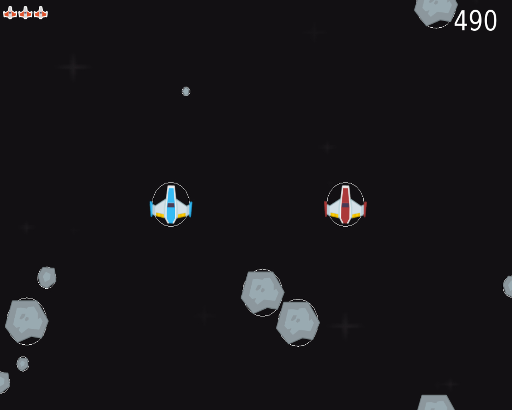

# Asteroids 

Custom game on Asteroids style. One of the oldest games we know. Assets are took from internet. This is a school project and is used for educational purposes only. 

## Getting Started
Here are some instructions to try this game.

### Prerequisites

1. Python 
2. Any Python IDE
3. Pyglet, math, random libraries 

### Installing 

1. Install required libraries from links down bellow
[Installing pip on different systems](https://pip.pypa.io/en/stable/installation/)
[Installing pyglet on different systems](https://pyglet.readthedocs.io/en/latest/programming_guide/installation.html)
[Installing math on different systems](https://www.codegrepper.com/code-examples/shell/how+to+install+math+module+in+python)
2. Run 4.py
3. Enjoy

## Built using

* [Pyglet library](https://pyglet.readthedocs.io) - Main library used in whole code
* [VS Code](https://code.visualstudio.com/) - IDE

## Authors 

[SleepFoxx](https://github.com/SleepFoxx)

## License

* [5e copyright](https://paypal.me/SleepFoxx)
